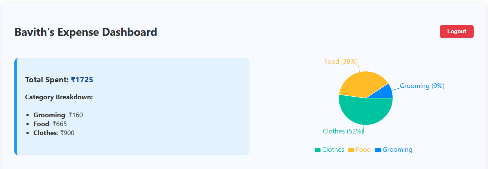
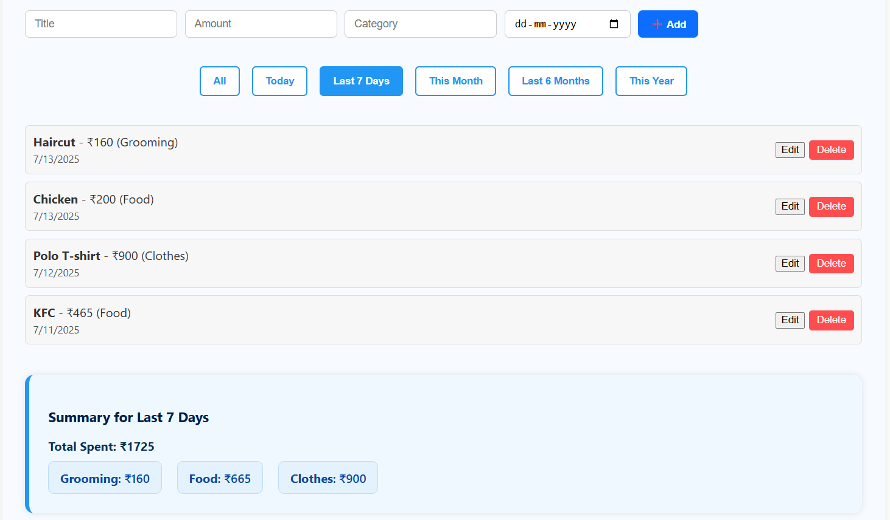

# Expense Tracker App

A full-stack Expense Tracker built with *React.js, **Node.js, **Express, and **MongoDB*, allowing users to securely manage their personal expenses with category-wise analysis, date-based filters, and visual charts.

---

## Features

- *User Authentication (JWT)*
  - Secure signup/login
  - Protected dashboard route

- *Dashboard*
  - Displays total and category-wise expenses
  - Pie chart visualization using Recharts

- *Add, Edit, Delete Expenses*
  - Track title, amount, category, and date
  - Instant updates with automatic refresh

- *Date-Based Filters*
  - Filter by:
    - Today
    - Last 7 Days
    - This Month
    - Last 6 Months
    - This Year

- *Expense Summary*
  - View filtered totals and category-wise breakdown

- *Responsive Design*
  - Works beautifully on desktop, tablet, and mobile

---
## Preview




---

## Tech Stack

| Frontend         | Backend        | Database   | Other          |
|------------------|----------------|------------|----------------|
| React.js         | Node.js        | MongoDB    | JWT Auth       |
| Axios            | Express.js     | Mongoose   | Recharts       |
| React Hooks      | CORS           | Dotenv     | Date Filtering |

---

### Setup Instructions

1. Clone the repository:
   ```bash
   git clone https://github.com/BavithSuvarna/Personal-Expense-Tracker
   ```

2. Navigate into the project directory:
   ```bash
   cd Personal-Expense-Tracker
   ```
3. Install frontend dependencies
   ```bash
   cd frontend
   npm install
   ```
   
4. Install backend dependencies
   ```bash
   cd ../backend
   npm install
   ```
   
5. Set up Environment Variables
     - Create a .env file inside the server/ directory and add the following:
       - PORT=5000
       - MONGO_URI=your_mongodb_connection_string
       - JWT_SECRET=your_jwt_secret
     - If you have environment-specific frontend URLs or API endpoints, you may also configure .env in the frontend/ directory.
6. Start the application:
     Start the backend server:
     ```bash
     cd backend
     nodemon server.js
     ```
     
     Start the frontend app:
     ```bash
     cd frontend 
     npm start
     ```
7. Visit the application at http://localhost:3000 in your browser.
